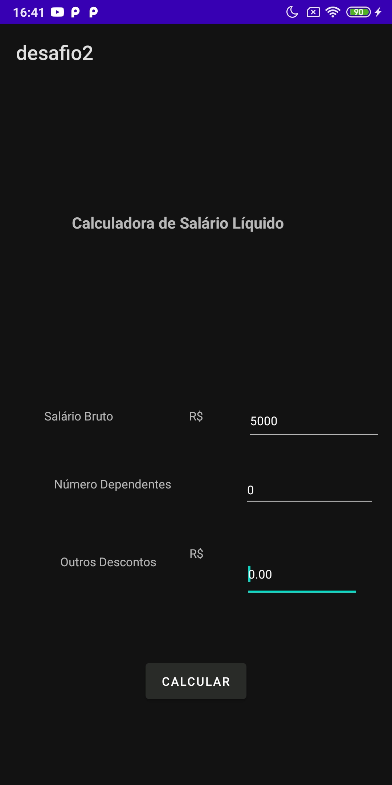

# Bootcamp mobile

Repository used to save applications build in IGTI mobile bootcamp, using Java for android applications, react native and flutter.

## Desafio 1

This folder is related to the challenge in first unit, that uses a endpoint provided by the teach to retrieve fake users bank data. Based on the endpoint result, was requested to do some calculation and answer the quiz. Each console is a question answer.

## Trabalho 2

Application build on java for android platform, calculates the net salary, given the gross salary, dependents amount and other discounts. The result is calculated using brazilian reference values.

